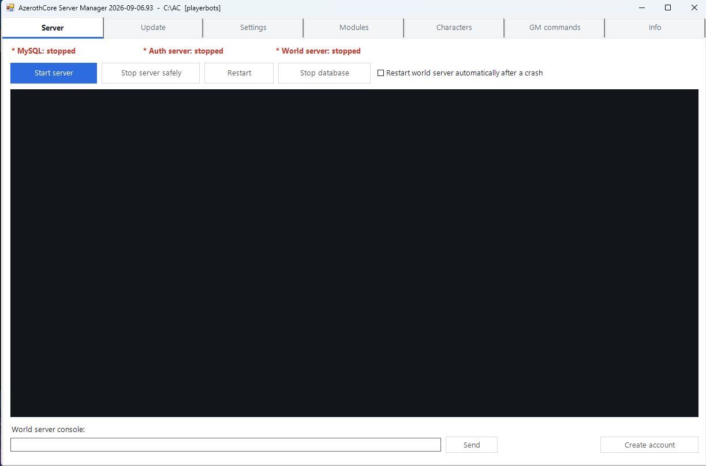
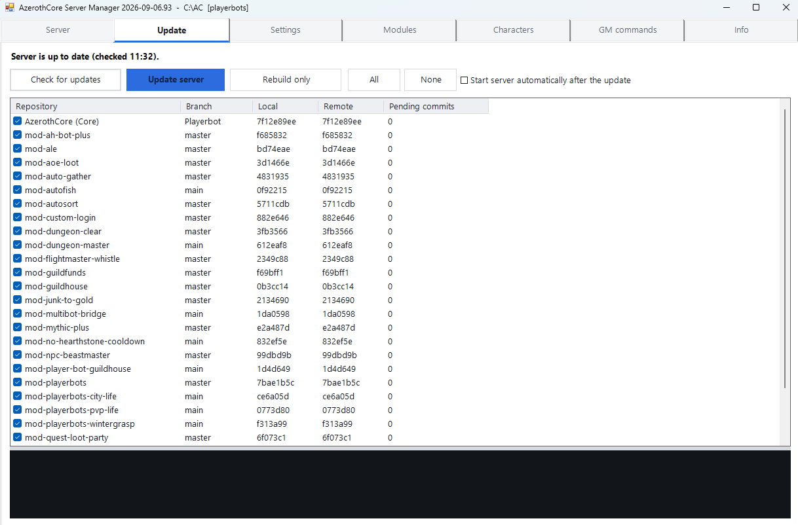
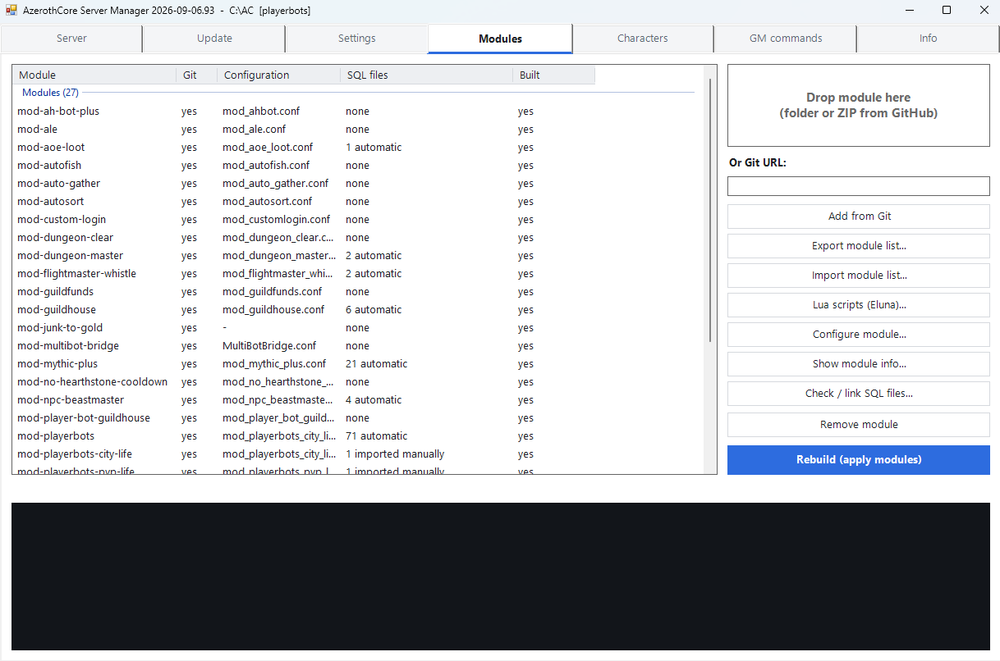
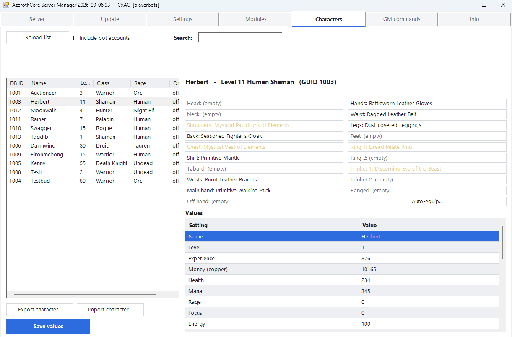
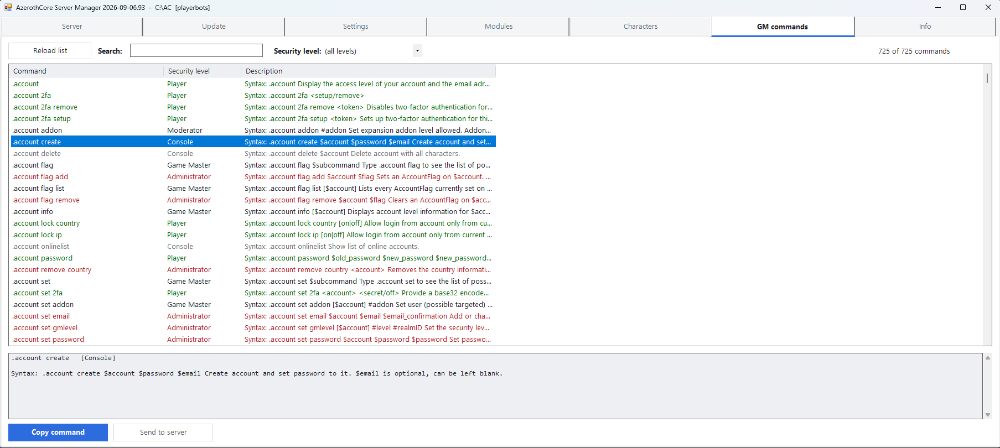

# AzerothCore Server Manager


Set up a complete **World of Warcraft 3.3.5a** private server on Windows and run it — without touching Git, CMake or MySQL by hand.

Two GUIs built on PowerShell and WinForms. Nothing to install first: they run on the PowerShell that ships with Windows.

* **Installer** — one wizard from an empty PC to a running server
* **Manager** — daily operation: start/stop, updates, configuration, modules, characters, GM commands

Interface in **English by default**, German available; light and dark theme with dark title bar, scrollbars and list headers. Both switchable at runtime — the installer remembers the language you pick.

Only one manager runs per server folder: starting it again brings the existing window to the front instead of opening a second one on the same database.

---

## Screenshots








---

## Quick start

1. Download the latest [release](../../releases) and unpack it anywhere.
2. Right-click `Install-AzerothCore.bat` → **Run as administrator**.
3. Pick a folder (`C:\AC` works well), pick the server variant, press **Start installation**.
4. When it finishes: open the manager, **Start server**, create an account.
5. In your WoW 3.3.5a client set `realmlist.wtf` to `set realmlist 127.0.0.1`.

Expect 1–2 hours, most of it the C++ build. Full walkthrough: **[docs/USAGE.md](docs/USAGE.md)** (also in [German](docs/USAGE.de.md)).

### Requirements

| | Minimum | Recommended |
|---|---|---|
| OS | Windows 10 (1809+) or 11, 64-bit | Windows 11 |
| Disk | 25 GB | 40 GB |
| RAM | 8 GB | 16 GB |
| Other | Internet connection, a legally obtained WoW 3.3.5a client | |

`winget` is used when available but is **not required** — the installer downloads everything directly otherwise.

---

## What the installer does

1. Creates the folder structure and copies the tools into `<folder>\tools`
2. Installs Git, CMake, OpenSSL, the VC++ redistributable and the **Visual Studio 2022 Build Tools**, preferring `winget` and falling back to direct downloads. Git, CMake and OpenSSL then land **portably inside the server folder**; only the Build Tools are always system-wide.
3. Installs Boost
4. Unpacks **MySQL as a portable instance**, initialises it, creates databases and users with random passwords
5. Clones the source of the chosen variant — or updates an existing clone from an earlier attempt — and logs the exact commit it builds
6. Runs CMake and builds the server
7. Downloads the client data (dbc, maps, vmaps, mmaps)
8. Runs `dbimport` and registers the realm
9. Cleans up downloads, extraction leftovers and empty folders

Every step is recorded in `ac-settings.json`. If something fails, the installer stops with the cause visible and **Try again** resumes at that exact step.

### Server variants

| Variant | Repository | Notes |
|---|---|---|
| Without playerbots | `azerothcore/azerothcore-wotlk` (master) | Faster build, gets upstream changes first |
| With playerbots | `mod-playerbots/azerothcore-wotlk` (Playerbot) + `mod-playerbots` | Bots as fellow players, roughly double the build time |

Chosen once; switching later means reinstalling.

---

## Features

### Server
Starts and stops the three services in the correct order, with a real shutdown (`server shutdown`) so characters are saved before the process ends. Combined live console for MySQL, auth and world server, a command input line, a button to create **accounts** (with an optional GM tick), optional auto-restart after a crash, and a separate **Stop database** button for when only MySQL is running.

### Update
`git fetch` for the core and every module on demand — never automatically at startup. After a check, only repositories that actually have pending commits are ticked; untick any you want to hold back, for example a module with a broken update. **Update server** then runs the whole chain in one click: safe shutdown → `git pull --ff-only` for the ticked repositories → link module SQL → CMake → build → `dbimport` → optional restart. All other tabs are locked while it runs.

When a build fails, the compiler errors are pulled out of the MSBuild log and shown in the dialog, the offending module is named, and a missing include file is looked up across the source tree — so you learn whether the file is merely in the wrong place or missing entirely (a module that needs a companion module).

CPU usage during the build is configurable: full speed, balanced, or background.

### Settings
Key/value editor for `worldserver.conf`, `authserver.conf`, `dbimport.conf` and every module config, with search and the original comments as inline help. Only changed lines are written, so comments and ordering survive. Holds the language switch, the light/dark theme switch and a **Reset random bots** button that also performs the restart the playerbots module requires.

### Modules
Install by drag & drop (folder or GitHub ZIP) or by Git URL. The tool:

* links **SQL files** from legacy layouts (`sql/world/base`) into the path AzerothCore actually imports from, keeping `base` before `updates`; copies are tracked in a manifest, removed before every `git pull` and recreated afterwards
* detects the common failure where a module's `base` SQL was never applied — AzerothCore only runs `base` files on an empty database — and offers to apply it and retry
* applies bundled **DBC files** into `data\dbc` with a timestamped backup
* opens each module's **own configuration**, including a character picker for settings that need a character GUID (AH bot and similar)
* shows a **module info** view with the NPC, object and item IDs a module adds plus the ready-to-use `.npc add` command, its GM commands, its config keys and the full README
* tracks per module whether it is **actually built into the server** yet
* neutralises a fixed database name (`USE …`) inside a module's SQL so the file goes into the database you picked
* detects a module folder whose name no longer matches the project (after a rename) and offers to correct it
* warns before the build if a module requires the playerbot fork but the server runs official AzerothCore

The list shows C++ modules and Lua script packages in two collapsible groups. **Export module list** writes every module and Lua package with its repository address, branch and commit to a JSON file; **Import module list** recreates that set on another server, asking whether to fetch the recorded commits or the current state of each branch.

### Lua scripts
A Lua engine (mod-ale or ElunaAzerothCore) can be installed from the modules tab, including the `LUA_VERSION` switch CMake needs. Script packages install from a Git URL, a folder or a ZIP; if one is dropped in as a module by mistake, the manager recognises it as a script package and moves it to the right place. Bundled SQL is offered with a target database, client addon files that ended up in the server folder are detected, and individual scripts can be switched on and off.

### Characters
Edits the database directly. Random bots are filtered out via the account prefix from `playerbots.conf`; your own alts stay visible.

* 19 equipment slots with item names in quality colours and full stats on hover
* item picker filtered to the slot, to what the class may actually equip (armor type, shields, relics, weapon types, dual wield, mail and plate from level 40) and to a level-appropriate item level range that keeps test and developer items out
* **Auto-equip** by role (tank, melee, ranged, caster, healer) with a preview before anything is written
* editable values: name, level, experience, money, health and all power types, appearance, honor, arena points, position, `at_login` and `playerFlags`
* **Export and import characters** as a JSON file — to hand a character to someone else, or to bring one back. On import you choose between creating a new character and updating an existing one of the same race and class: level, gear, spells, skills and talents are taken over, while guild, friends, mail and bank stay untouched; explored zones, flight paths, titles, achievements, reputation and completed quests are merged, and items that no longer fit into the bags arrive by mail

Safety rules the manager enforces: logged-in characters are never touched, and equipment changes require a stopped world server because a running server hands out its own item GUIDs. Stale `online` flags from a crashed server are detected and reset.

### GM commands
The command list of the current build, read from `acore_world.command` — including the commands your modules add. Search, filter by security level, copy to clipboard, or send straight to the running server.

---

## Folder layout

```
C:\AC\
├─ Start-Manager.bat              start the manager
├─ Resume-Installation.bat        resume / repair the installation
├─ ac-settings.json               variant, ports, database credentials
├─ source\                        source code (git) + source\modules\
├─ build\bin\RelWithDebInfo\      worldserver.exe, authserver.exe, dbimport.exe, configs\
├─ data\                          dbc, maps, vmaps, mmaps
├─ mysql\data\                    the database — accounts, characters, world
├─ deps\                          Boost, plus portable Git/CMake/OpenSSL if used
├─ logs\                          install.log, manager.log, build.log, DBErrors.log
└─ tools\                         the five scripts
```

Backup = copy `mysql\data\` and `build\bin\RelWithDebInfo\configs\` while the server is stopped.

---

## Scripts

| File | Purpose |
|---|---|
| `Install-AzerothCore.bat` | launcher, requests administrator rights |
| `AzerothCore-Installer.ps1` | installation wizard |
| `tools/AzerothCore-Manager.ps1` | manager GUI |
| `tools/AC.Common.ps1` | shared functions: processes, downloads, build, config, module SQL |
| `tools/AC.Char.ps1` | database access for the character editor and GM commands |
| `tools/AC.Lang.ps1` | all UI strings, German and English |
| `tools/AC.Theme.ps1` | colour palettes and control styling (light / dark) |

The manager runs from `<folder>\tools`, not from where you unpacked the download. To update, copy the new scripts there — the version in the title bar tells you which build is running.

---

## Troubleshooting

Full list in [docs/USAGE.md](docs/USAGE.md#part-5--troubleshooting). The most common ones:

* **Build fails with `error C2xxx` in a module** — the module does not match the current core. The manager names it; remove it or use an older version.
* **Path too long / `LNK1104`** — reinstall into a short path without spaces.
* **World server exits immediately** — read the first red line in the console; usually missing client data or a database update that was not applied.
* **`dbimport` fails on a module SQL file** — see `logs\DBErrors.log`; the manager offers to apply missing `base` files automatically.

Logs live in `<folder>\logs\`.

---

## Contributing

Bug reports are most useful with the relevant part of `logs\manager.log` or `logs\install.log`, the manager version from the title bar and the server variant. Please never paste `ac-settings.json` — it holds your database passwords in plain text. See [CONTRIBUTING.md](CONTRIBUTING.md) for the conventions the scripts follow.

## Licence and third-party software

Released under a [custom licence](LICENSE): use it freely, pass it on unchanged, but publishing a modified version needs my consent. The tool **bundles no third-party software** — everything is downloaded from its original source at install time. See [THIRD-PARTY.md](THIRD-PARTY.md) for what is fetched and under which licence.

**A legally obtained World of Warcraft 3.3.5a client is required.** This project contains no Blizzard game data. World of Warcraft is a trademark of Blizzard Entertainment; this project is not affiliated with or endorsed by Blizzard Entertainment.
